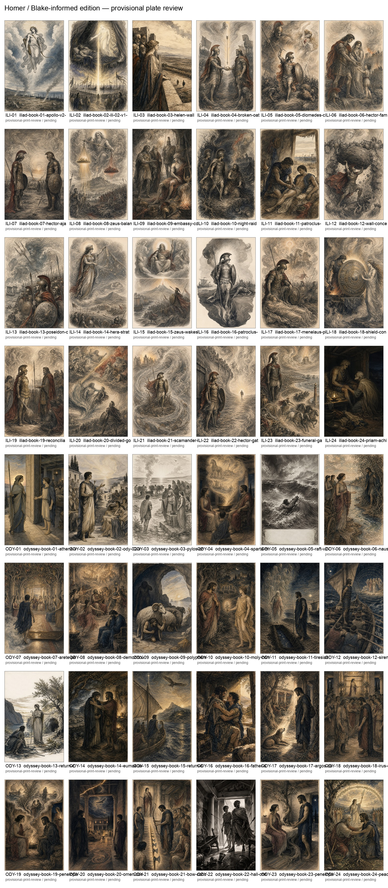

# Provisional plate review contact sheet



This contact sheet is a visual aid for the human art-direction review. It
contains the current 48 print-review derivatives in book order: Iliad 1–24,
then Odyssey 1–24. Every tile is still `provisional-print-review` and
`pending`; the sheet does not approve, license, or promote any image.

The labels identify the placeholder slot and current plate ID. Reviewers must
use [`plate-selection-audit.csv`](plate-selection-audit.csv) for the exact
passage, creator, rights boundary, derivative path, and open gate fields, and
must inspect the native source and prompt record before making a decision.

## Rebuild

```sh
python3 scripts/build_plate_review_contact_sheet.py
```

The sheet is generated from the audit CSV and the 2055 × 3142 px print-review
derivatives. It is for comparison at a glance, not a substitute for
full-resolution trim-safety, caption, Greek/English passage, rights, or
physical-proof review.
